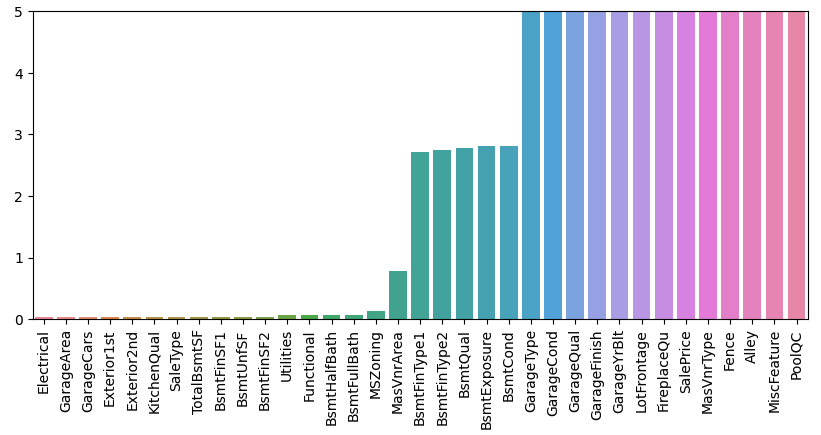

# Housing_Data
Regression predictions from Kaggle competition [www.kaggle.com](https://www.kaggle.com/competitions/house-prices-advanced-regression-techniques) where training and test data sets are provided.
The data sets are 'un-cleaned' with empty rows and fields that need to be treated in various ways.

### 1) Clean the Data
Combined the Train and Test so that all treatments are done uniformly (necessary for using dummy variables in the following steps).

Image below shows the "percent missing" of the initial data set.

Cleaning Treatments:
* Drop rows that are outliers
* Drop rows that are nearly empty
* Fill empty fields
  * Numerical fields filled with 0
  * Object fields usually filled with 'None'
  * Average of similar values (same Neighborhood) to fill 'LotFrontage' fields
 
### 2) Use training data test protcol
The hypothesis is that the numerical fields could be good enough for a strong model. The other option is to use 'dummy' variables for the catagories or object fields.

Elastic Net Simple model. (housing-data.ipynb)
* Numerical Data only
  * Time to run: 10.81s
  * RMSE of log values = 0.274
* All Data (dummy and numerical)
  * Time to run: 96.33s
  * RMSE of log values = 0.154
The extra data makes the fit take ~10x as long but has a measurably better error value.

Random Forest Regression model. (housing-data_rfr.ipynb)
* All Data (dummy and numerical)
  * Time to run: 0.34s
  * RMSE of log values = 0.144
This model is substantially faster and has a comparable error on test set.

Neural Network model. (housing-data-nn.ipynb)
* All Data (dummy and numerical)
  * Time to train: 37.59s
  * RMSE of log values = 0.154
 Similar results but slightly worse than the RFR model.

Gradient Boosted Regressor model. (housing-data_boost.ipynb)
* All Data (dummy and numerical)
  * Time to run: 142.81s
  * RMSE of log values = 0.156

### 3) Final train and test
The dummy variables made the RMSE better so that is what is used for the final data set predictions.
Use the entire training set to train the scaling with a few of the different models that are shown above.

Results:

Elastic net over fit with poor results: 
* Score = 6.7271
  
Random Forest Regression was quite good:
* Score = 0.15474
  
Neural Network Model:
* model = TabluarModel(emb_szs, con_train.shape[1], 1, [100,50], 0.4)
* optimizer = torch.optim.Adam(model.parameters(),lr=0.02)
* Score = 0.19349
  
Gradient Boost Model:
* **Score = 0.14466 BEST**

 
